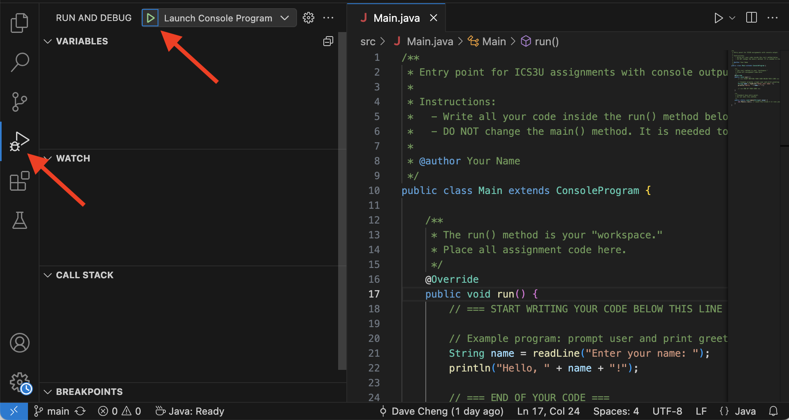
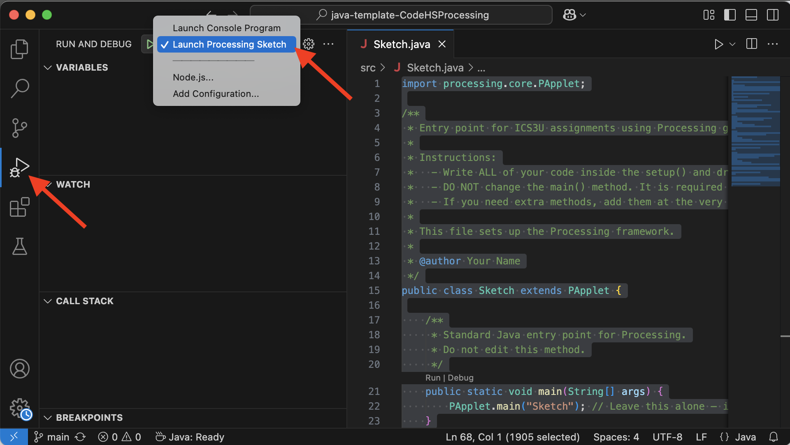

# ICS3U Base Template for Java Programming
This repository is a starter for ICS3U assignments. 

For a guide on using GitHub with Visual Studio Code, click [here](https://github.com/SACHSTech/Using-GitHub).

## Includes
- ConsoleProgram setup for CodeHS-style helper input/output methods
- Processing starter code (`Sketch.java`)
- VS Code launch configurations for running console and graphics programs

## Getting Started
1. Clone this repo in VS Code.
2. Open the `src` folder.
3. Edit `Main.java` (or create new files that extend `ConsoleProgram`) for text-based programs.
4. Edit `Sketch.java` to write programs with Processing graphics.

## Running Your Programs
Use the **Run and Debug panel** (on the left sidebar) to launch programs.  
   - Select **Launch Console Program** when running text-based programs (e.g., `Main.java`, `MyProgram.java`, etc.).  
   

   - Select **Launch Processing Sketch** when running graphics assignments (`Sketch.java`).  
   
   - Avoid using the Play ▶ button in the editor toolbar (see top-right corner). It always repeats the previous successful launch config and may run the wrong one.
